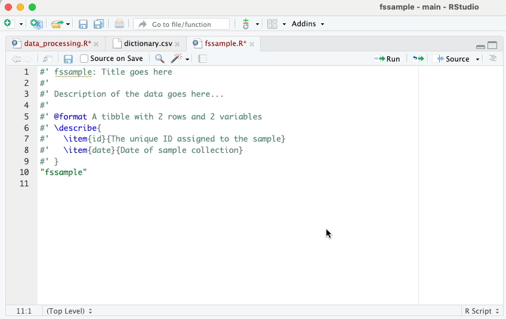

```{r, include = FALSE}
knitr::opts_chunk$set(
  collapse = TRUE,
  comment = "#>",
  eval = FALSE
)
```

This vignette demonstrates the `washr` data package development workflow with a toy dataset titled `fssample`. The `fssample` data is an (imaginary) 5-day sample collection of faecal sludge. The raw data is a spreadsheet titled as `sample.xlsx`.

> You are taking 20 samples of 1 liter faecal sludge from pit latrines and septic tanks at households and public toilets (5 samples each). For each sample, you note the number of daily users of the sanitation system.[^1]

[^1]: Your sample collection starts on 1st November 2022. On day 5, you analyse the data in the laboratory for totals solids (TS) in g/L. In your spreadsheet, note the exact date of each collected sample.

    This is you data collection plan:

    -   Day 1: 5 samples at households using pit latrines
    -   Day 2: 5 samples at households using septic tanks
    -   Day 3: 5 samples at public toilets that are pit latrines
    -   Day 4: 5 samples at public toilets that are septic tanks
    -   Day 5: Analyses of all 20 samples for total solids (TS) in g/L on a lab scale with accuracy of 0.01 g

    Make up the results for the total solids (TS) analyses (e.g. 12.48 g/L).

You can download the raw data `sample.xlsx` here: <https://github.com/openwashdata-dev/washr/blob/main/inst/extdata/sample.xlsx>

```{r setup}
library(washr)
library(devtools)
```

Initialize an R package titled with `fssample` with `devtools`:

```{r create_package}
devtools::create("path/to/fssample package directory/")
# devtools::create("~/Desktop/openwashdata/fssample")
```

The `fssample` directory now is set up as an R package with the following structure:

```         
fssample/
│
├── .gitignore
├── .Rbuildignore
├── DESCRIPTION
├── fssample.Rproj
├── NAMESPACE
└── R/
```

We will continue to work inside this directory to build the data package.

# Create and process dataset

First, set up the raw data in the package directory by executing:

```{r setup_rawdata}
setup_rawdata()
```

Under the `fssample` directory, a new directory `data-raw` with an R script `data_processing.R` is created.

Place the raw data `sample.xlsx` inside the `data-raw` directory.

Go to `data_processing.R` and refer to our template code to import, clean, and export the dataset. For instance, you may want to fill the empty cells of the column `location` or change its data type to "factor".

An exemplary `data_processing.R` script is as follows:

```{r data_processing}
# Description ------------------------------------------------------------------
# R script to process uploaded raw data into a tidy, analysis-ready data frame
# Load packages ----------------------------------------------------------------
## Run the following code in console if you don't have the packages
## install.packages(c("usethis", "fs", "here", "readr", "openxlsx"))
library(usethis)
library(fs)
library(here)
library(readr)
library(readxl)
library(openxlsx)
## Load your needed libraries

# Read data --------------------------------------------------------------------
data_in <- read_excel("data-raw/sample.xlsx")

# Tidy data --------------------------------------------------------------------
## Clean the raw data into a tidy format here
fssample <- data_in |>
  dplyr::rename(users = `Users (daily)`, ts = `TS (g/L)`) |>
  dplyr::rename_all(tolower) |>
  tidyr::fill(date) |>
  tidyr::fill(location) |>
  tidyr::fill(system) |>
  dplyr::mutate(across(c(location, system), as.factor))

# Export Data ------------------------------------------------------------------
usethis::use_data(fssample, overwrite = TRUE)
fs::dir_create(here::here("inst", "extdata"))
readr::write_csv(fssample,
                 here::here("inst", "extdata", paste0("fssample", ".csv")))
openxlsx::write.xlsx(fssample,
                     here::here("inst", "extdata", paste0("fssample", ".xlsx")))
```

Once the data cleaning is done, run the entire `data_processing.R` script. Then, a directory `data/` that contains the exported (tidy) data in `.rda` format is created in the package root directory. The package directory now should look like the following structure:

```         
fssample/
│
├── .gitignore
├── .Rbuildignore
├── DESCRIPTION
├── fssample.Rproj
├── NAMESPACE
├── data/
├───── fssample.rda
├── data-raw/
├───── sample.xlsx
└── R/
```

# Document dataset

The next step is to provide human and machine-readable documentation for the tidy dataset and the package itself.

## Document the package

To document the data package, the most important file is `DESCRIPTION`. You work with the `DESCRIPTION` file by running:

```{r update_dict}
update_description()
```

Notice that you still need to write the title, description and authors in the DESCRIPTION file. The function does NOT automatically update these fields.

## Document the dataset

When other people use the dataset, they need to understand what each column (i.e. variable) means. This information can be documented in a table format like, for example:

| variable | description                                        |
|----------|----------------------------------------------------|
| date     | Date of the sample collection in format YYYY-MM-DD |
| location | Location type of the sample collection             |
| ...      | ...                                                |

You create a dictionary for the dataset `fssample` in CSV file format by running:

```{r}
setup_dictionary()
```

Go to `data-raw/dictionary.csv`, open the CSV file.

-   Fill in the empty column `description` for each variable of the dictionary.
-   DO NOT add new lines or modify other columns of this file.

Once the dictionary is complete, you document the dataset in R documentation system with the so-called ["roxygen comments"](https://cran.r-project.org/web/packages/roxygen2/vignettes/rd.html). You convert the data dictionary CSV file into roxygen comments by executing:

```{r}
setup_roxygen()
```

This function generates the R documentation files in `R/` with a placeholder line for the title and description.

Now open `R/fssample.R` and fill in the title and description for this dataset.

{width="630"}

# Communicate dataset

The R dataset and documentation are complete. It's time to communicate with the public using human-readable and visually appealing tools. We currently achieve this with the following two components.

-   README
-   pkgdown website

## README

```{r}
setup_readme()
# Go to README.Rmd and complete this R Markdown file
build_readme() # Generate README.md from README.Rmd
```

## Pkgdown Website

```{r}
setup_website()
```

Now, it's time to work on polishing the README and website. Once you are satisfied with them, don't forget to re-run `build_readme()` and `build_site()` again to update.

## Citation

First, we create a dummy citation file for Zenodo to retrieve information about the package.

```{r}
library(cffr)
cffr::cff_write_citation()
```

Submit to Zenodo and get a DOI

```{r}
update_citation(doi = "put zenodo DOI string here")
```
